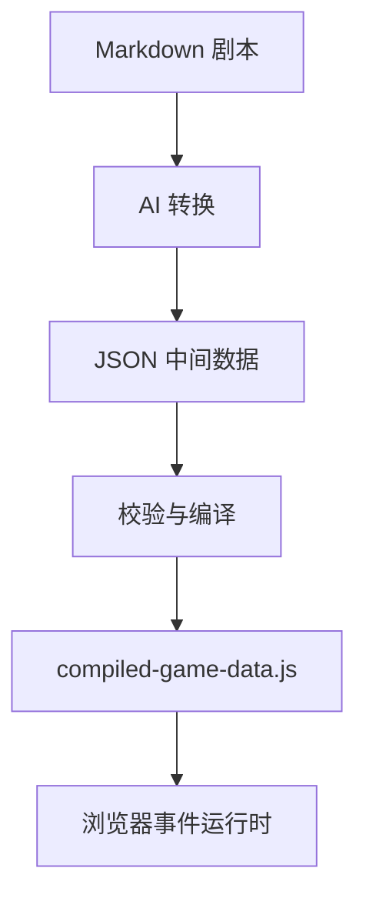

# 游戏框架设计文档 v0.1

## 目标与边界

这是一个事件驱动的轻量剧情解释器，不是通用游戏引擎。当前同时只显示一个车厢；场景负责“看见什么”，事件负责“发生什么”，状态负责“已经发生过什么”。

事件可以顺序执行多个原子动作，但“等待玩家在场景中点击某物”必须成为事件边界。前一事件自然结束，物件点击再启动后一事件；不保存半个事件的调用栈。

## 数据流



JSON 选择中间格式而非最终格式，是为了在编译阶段集中检查重复 ID、悬空事件引用、无效场景和无效物品；编译结果使用普通 JS，保证本地双击也能运行。

## 模块职责

| 模块 | 职责 | 不负责 |
| --- | --- | --- |
| `GameState` | 属性边界、技能触发与屏蔽、旗标、物品、物件状态、检定结果 | DOM 与剧情跳转 |
| `SceneManager` | 单场景背景、贴图物件、点击入口、显示条件 | 物件点击后的剧情逻辑 |
| `EventEngine` | 读取事件并顺序解释动作、处理分支 | 具体画面布局 |
| `GameWindow` | 可扩展窗口基类 | 决定何时弹窗 |
| `DialogWindow` | 流式文本、自动、快进、跳过本句 | 保存剧情状态 |
| `SaveManager` | 管理三个本地槽位的读取、写入、摘要与删除 | 判断事件状态是否稳定 |
| `PageFlow` | 集中管理页面路径、入口参数和 `sessionStorage` 临时交接 | 持久化正式存档 |
| 数据编译器 | 静态校验并生成最终数据包 | 运行游戏 |

## 核心约束

1. Scene Object 只保存图片、位置、显示条件和 `clickEvent`，不内嵌对话或发物品逻辑。
2. 场景切换、隐藏物件、修改属性等都是事件中的原子动作。
3. 分支动作 `choice` 与 `check` 结束当前事件，并以目标事件继续执行。
4. 自定义 JS 使用白名单注册；JSON 只写注册名和普通参数，禁止 `eval`、函数字符串和任意全局函数访问。
5. `EventEngine` 在完整事件链成功结束后更新稳定快照。事件执行中可以打开暂停菜单，但保存和返回主界面都以该快照为准，不保存半个事件的调用栈。
6. 事件执行中禁用场景物件的点击和高亮；只有普通对话允许通过点击文本框外的场景推进，选择与调查仍使用各自窗口。
7. 启动时先显示由 `meta.title` 和 `meta.coverImage` 配置的正式主界面，不在玩家选择前自动运行开场事件；损坏或不兼容的存档不得污染当前状态。
8. 属性和技能必须先在各自数据表注册。所有属性修改经过 `GameState` 方法，以统一保证整数边界并同步自动技能。
9. 新游戏的属性分配先写入临时草稿；用完全部点数并确认后才写入状态、计算自动技能并运行开场事件。
10. `setSkill` 不屏蔽自动触发；`learnSkill` 或 `loseSkill` 首次使用后在该存档内永久屏蔽对应技能的自动触发。
11. 主页、游戏、存档管理、存档写入、结束和信息页使用独立 HTML，并且必须部署在同一静态服务器来源下。
12. 事件执行期间不能跨页保存；稳定状态由 `sessionStorage` 交给写入页，正式槽位存入 `localStorage`。
13. 动作完成后 SAN 降至 0 会触发运行时终止条件，剩余事件不再执行，也不覆盖上一次主动保存的槽位。

## 状态示例

```json
{
  "sceneId": "carriage_06",
  "currentEventId": "E_NOTE",
  "attributes": { "insight": 65, "san": 80 },
  "skills": { "keen_insight": false },
  "skillOverrides": {},
  "attributeAllocationComplete": true,
  "flags": { "gameStarted": true },
  "inventory": ["old_ticket"],
  "objectStates": { "note_06": { "hidden": true } },
  "checkResults": {}
}
```

## 暂不进入 v0.1 的内容

- 云存档与服务器同步。
- 通用 NPC 注册系统。
- Canvas 像素级命中检测。
- 可恢复到事件中间某一句的协程式存档。
- 任意表达式求值器。
- 独立物品栏窗口、物品详情与主动使用物品；当前只在顶部 HUD 显示物品名称。
