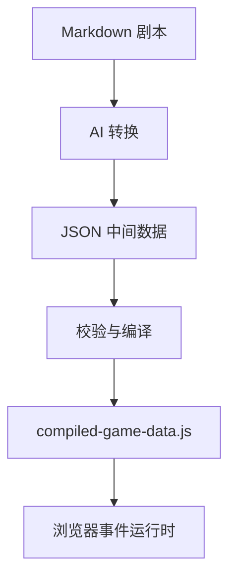

# 游戏框架设计文档 v0.1

## 目标与边界

这是一个事件驱动的轻量剧情解释器，不是通用游戏引擎。当前同时只显示一个车厢；场景负责“看见什么”，事件负责“发生什么”，状态负责“已经发生过什么”。

事件可以顺序执行多个原子动作，但“等待玩家在场景中点击某物”必须成为事件边界。前一事件自然结束，物件点击再启动后一事件；不保存半个事件的调用栈。

## 数据流



JSON 选择中间格式而非最终格式，是为了在编译阶段集中检查重复 ID、悬空事件引用、无效场景和无效物品；编译结果使用普通 JS，保证本地双击也能运行。

## 模块职责

| 模块 | 职责 | 不负责 |
| --- | --- | --- |
| `GameState` | 属性、旗标、物品、物件状态、检定结果 | DOM 与剧情跳转 |
| `SceneManager` | 单场景背景、贴图物件、点击入口、显示条件 | 物件点击后的剧情逻辑 |
| `EventEngine` | 读取事件并顺序解释动作、处理分支 | 具体画面布局 |
| `GameWindow` | 可扩展窗口基类 | 决定何时弹窗 |
| `DialogWindow` | 流式文本、自动、快进、跳过本句 | 保存剧情状态 |
| `SaveManager` | 将稳定游戏状态写入 `localStorage` | 保存事件中间调用栈 |
| 数据编译器 | 静态校验并生成最终数据包 | 运行游戏 |

## 核心约束

1. Scene Object 只保存图片、位置、显示条件和 `clickEvent`，不内嵌对话或发物品逻辑。
2. 场景切换、隐藏物件、修改属性等都是事件中的原子动作。
3. 分支动作 `choice` 与 `check` 结束当前事件，并以目标事件继续执行。
4. 自定义 JS 使用白名单注册；JSON 只写注册名和普通参数，禁止 `eval`、函数字符串和任意全局函数访问。
5. 存档发生在稳定状态上。第一版在事件执行期间禁用保存和场景点击；存档使用浏览器 `localStorage` 的 `train-game-save-v1` 键，不在项目目录中生成存档文件。
6. 启动时先显示“开始新游戏 / 读取存档”菜单，不在玩家选择前自动运行开场事件；损坏或不兼容的存档不得污染当前状态。

## 状态示例

```json
{
  "sceneId": "carriage_06",
  "currentEventId": "E_NOTE",
  "attributes": { "insight": 65, "san": 80 },
  "flags": { "gameStarted": true },
  "inventory": ["old_ticket"],
  "objectStates": { "note_06": { "hidden": true } },
  "checkResults": {}
}
```

## 暂不进入 v0.1 的内容

- 多存档槽、云存档与服务器。
- 通用 NPC 注册系统。
- Canvas 像素级命中检测。
- 可恢复到事件中间某一句的协程式存档。
- 任意表达式求值器。
- 独立物品栏窗口、物品详情与主动使用物品；当前只在顶部 HUD 显示物品名称。
